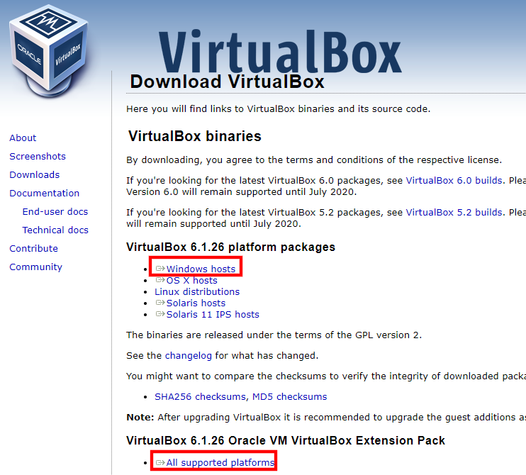

# 實作主題
```
1.DOWNLOAD(下載)並安裝() virtualbox

2.申請github
  將GITHUB PO在網路大學

3.使用GOOGLE gmail登入

4.使用Google colab開發Python
```

# 1.DOWNLOAD virtualbox

- [virtualbox](https://www.virtualbox.org/wiki/Downloads)



# 2.下載linux 的ova


# 3.申請github


# 4.電腦配置

