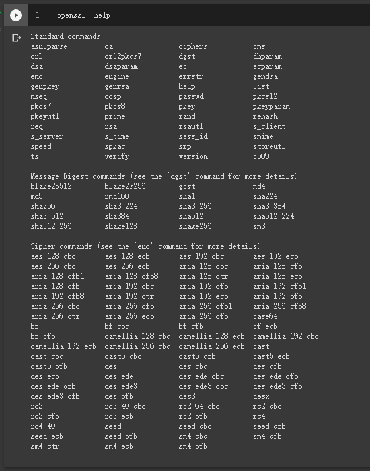
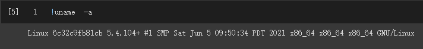

# OpenSSL
- [github](https://github.com/openssl/openssl)
- [Commands](https://github.com/JimLi999/CS2021/tree/main/CTF/20210916#list-all-openssl-commands)
- [check linux version](https://github.com/JimLi999/CS2021/tree/main/CTF/20210916#check-linux-version)
## list all OpenSSL commands
```
!openssl help
```

## check linux version
```
!uname -a
```
