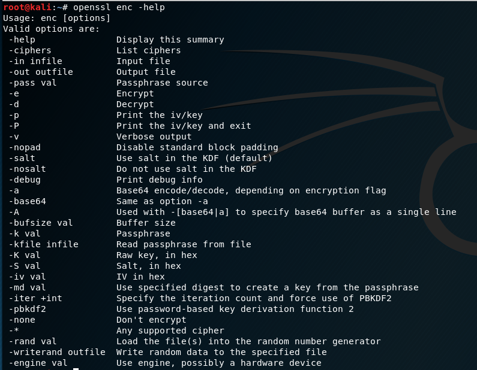

# OpenSSL
- [github](https://github.com/openssl/openssl)
- [Commands](https://github.com/JimLi999/CS2021/tree/main/CTF/20210916#list-all-openssl-commands)
- [Check Linux version](https://github.com/JimLi999/CS2021/tree/main/CTF/20210916#check-linux-version)
## list all OpenSSL commands
```
!openssl help
```

## check linux version
```
!uname -a
```

## list all OpenSSL enc commands
```
openssl enc -help
```
```
Valid options are:
 -help               Display this summary
 -ciphers            List ciphers
 -in infile          Input file
 -out outfile        Output file
 -pass val           Passphrase source
 -e                  Encrypt    //加密
 -d                  Decrypt    //解密
 -p                  Print the iv/key
 -P                  Print the iv/key and exit
 -v                  Verbose output
 -nopad              Disable standard block padding
 -salt               Use salt in the KDF (default)
 -nosalt             Do not use salt in the KDF
 -debug              Print debug info       //顯示調適訊息
 -a                  Base64 encode/decode, depending on encryption flag     //base64編解碼,取決於加密旗標
 -base64             Same as option -a      //與-a指令相符
 -A                  Used with -[base64|a] to specify base64 buffer as a single line
 -bufsize val        Buffer size        //緩衝區大小
 -k val              Passphrase     //密碼
 -kfile infile       Read passphrase from file      //從檔案讀取密碼
 -K val              Raw key, in hex        //以16進制顯示原始金鑰
 -S val              Salt, in hex       
 -iv val             IV in hex
 -md val             Use specified digest to create a key from the passphrase
 -iter +int          Specify the iteration count and force use of PBKDF2
 -pbkdf2             Use password-based key derivation function 2
 -none               Don't encrypt
 -*                  Any supported cipher
 -rand val           Load the file(s) into the random number generator
 -writerand outfile  Write random data to the specified file
 -engine val         Use engine, possibly a hardware device

```
