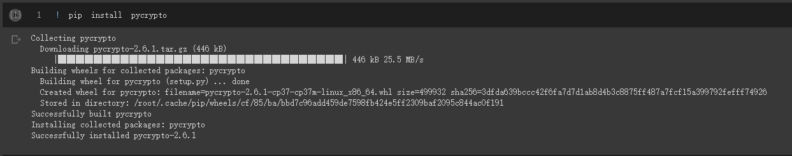

## 3_1_2_python現代密碼實測_pycrypto
- [Install pycrypto](https://github.com/JimLi999/CS2021/tree/main/CTF/20210923#install-pycrpto)
- [Module number](https://github.com/JimLi999/CS2021/tree/main/CTF/20210923#module-number)
- [Get Greatest Common Divisor](https://github.com/JimLi999/CS2021/tree/main/CTF/20210923#get-greatest-common-divisor)
# Install pycrypto
```python
pip install pycrypto
```

# Module number
- [Module number](https://pythonhosted.org/pycrypto/Crypto.Util.number-module.html)
# Get Greatest Common Divisor by pycrypto
透過 pycrypoto 函數庫取得最大公約(因)數
```python
from Crypto.Util.number import GCD

GCD(12,18)
```


