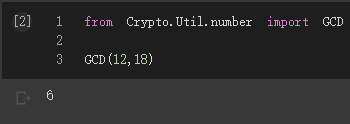
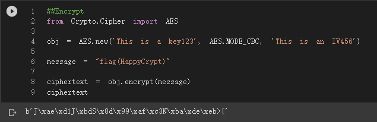
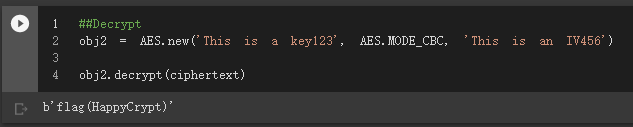

# 3_1_2_python現代密碼實測_pycrypto
- [Pycrypto](https://github.com/JimLi999/CS2021/tree/main/CTF/20210923#Pycrpto)

## Pycrypto
- [Install pycrypto](https://github.com/JimLi999/CS2021/tree/main/CTF/20210923#install-pycrpto)
- [Module number](https://github.com/JimLi999/CS2021/tree/main/CTF/20210923#module-number)
- [Get Greatest Common Divisor by pycrypto](https://github.com/JimLi999/CS2021/tree/main/CTF/20210923#get-greatest-common-divisor-by-pycrypto)
### Install pycrypto
```python
pip install pycrypto
```

### Module number
- [Module number](https://pythonhosted.org/pycrypto/Crypto.Util.number-module.html)
### Get Greatest Common Divisor by pycrypto
透過 pycrypoto 函數庫取得最大公約(因)數
```python
from Crypto.Util.number import GCD

GCD(12,18)
```

## AES對稱式加解密
### AES加密
```python

from Crypto.Cipher import AES

obj = AES.new('This is a key123', AES.MODE_CBC, 'This is an IV456')

message = "flag(HappyCrypt)"

ciphertext = obj.encrypt(message)
ciphertext
```

### AES解密
```python
obj2 = AES.new('This is a key123', AES.MODE_CBC, 'This is an IV456')

obj2.decrypt(ciphertext)
```



