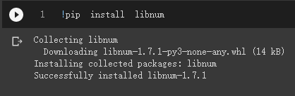
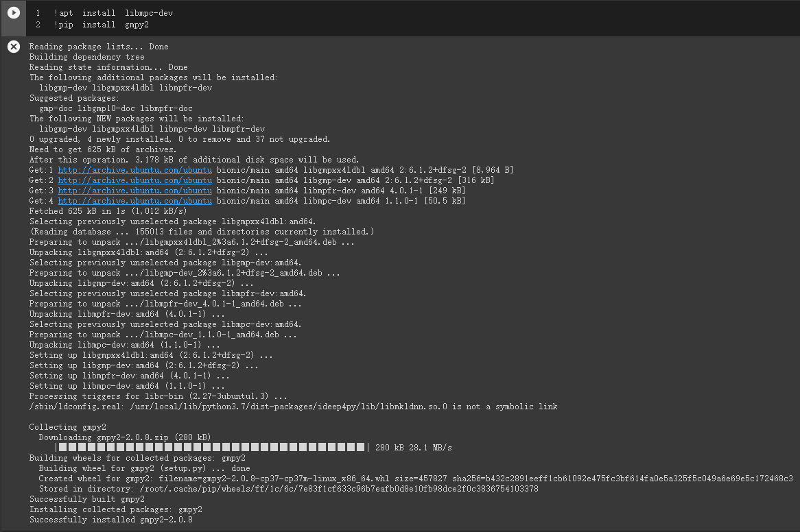

# 破密分析常用工具
- [Online tools](https://github.com/JimLi999/CS2021/tree/main/CTF/20210923/%E7%8F%BE%E4%BB%A3%E5%AF%86%E7%A2%BC%E4%B9%8B%E7%A0%B4%E5%AF%86%E5%88%86%E6%9E%90#%E4%BD%BF%E7%94%A8%E7%B7%9A%E4%B8%8A%E5%B7%A5%E5%85%B7---%E8%B3%AA%E5%9B%A0%E6%95%B8%E5%88%86%E8%A7%A3)
- [libnum](https://github.com/JimLi999/CS2021/tree/main/CTF/20210923/%E7%8F%BE%E4%BB%A3%E5%AF%86%E7%A2%BC%E4%B9%8B%E7%A0%B4%E5%AF%86%E5%88%86%E6%9E%90#libnum-%E5%A5%97%E4%BB%B6)
- [gmpy2](https://github.com/JimLi999/CS2021/tree/main/CTF/20210923/%E7%8F%BE%E4%BB%A3%E5%AF%86%E7%A2%BC%E4%B9%8B%E7%A0%B4%E5%AF%86%E5%88%86%E6%9E%90#gmpy2)

## 使用線上工具 == > 質因數分解    
- [factordb](http://factordb.com/)

## libnum 套件
```
libnum是python模組 ,具有底下功能:

使用質數primes(生成質數、是否為質數測試)
普通數學運算（gcd、lcm、n'th root）
模運算（逆，雅可比符號，平方根，求解 CRT）
將字串轉換為數字或二進位字串
```
- [Install libnum](https://github.com/JimLi999/CS2021/tree/main/CTF/20210923/%E7%8F%BE%E4%BB%A3%E5%AF%86%E7%A2%BC%E4%B9%8B%E7%A0%B4%E5%AF%86%E5%88%86%E6%9E%90#Install-libnum)
- [Functions](https://github.com/JimLi999/CS2021/tree/main/CTF/20210923/%E7%8F%BE%E4%BB%A3%E5%AF%86%E7%A2%BC%E4%B9%8B%E7%A0%B4%E5%AF%86%E5%88%86%E6%9E%90#functions)
- [Exercises](https://github.com/JimLi999/CS2021/tree/main/CTF/20210923/%E7%8F%BE%E4%BB%A3%E5%AF%86%E7%A2%BC%E4%B9%8B%E7%A0%B4%E5%AF%86%E5%88%86%E6%9E%90#exercises)

### Install libnum
```
!pip install libnum
```


### Functions
string to number,string to binary etc.
```
s2n(s) - packed string to number
n2s(n) - number to packed string
s2b(s) - packed string to binary string
b2s(b) - binary string to packed string
```

### Exercises
```python
import libnum

s="flag{happyCryptoDay}"
number = libnum.s2n(s)
number
```


```
print(libnum.n2s(number))
```


## gmpy2

- [gmpy2’s documentation](https://gmpy2.readthedocs.io/en/latest/)
- [Install gmpy2](https://github.com/JimLi999/CS2021/tree/main/CTF/20210923/%E7%8F%BE%E4%BB%A3%E5%AF%86%E7%A2%BC%E4%B9%8B%E7%A0%B4%E5%AF%86%E5%88%86%E6%9E%90#install-gmpy2)

### Install gmpy2
GMPY2 doesn't install
- [solution](https://stackoverflow.com/questions/50474091/gmpy2-doesnt-install)

```
!apt install libmpc-dev
!pip3 install --user gmpy2==2.1.0a2
```


# Homework

- complete https://cryptopals.com/ 

```python

import codecs

hex = "49276d206b696c6c696e6720796f757220627261696e206c696b65206120706f69736f6e6f7573206d757368726f6f6d“

b64 = codecs.encode(codecs.decode(hex, 'hex'), 'base64').decode()
b64
```