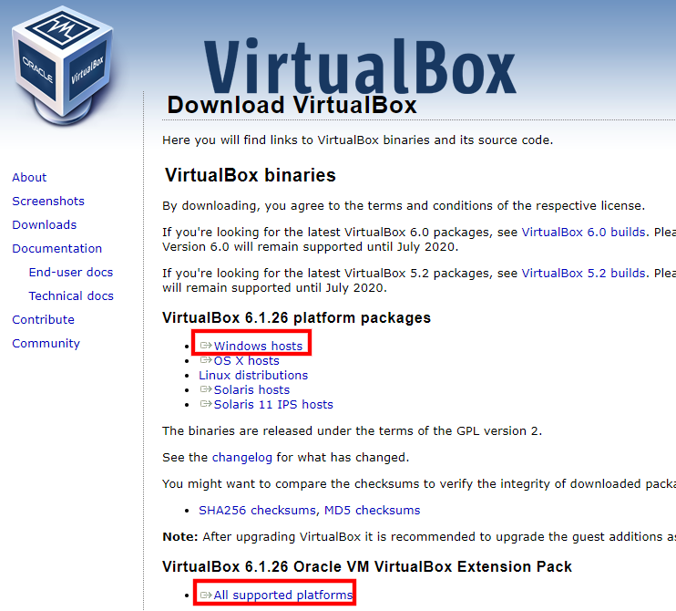
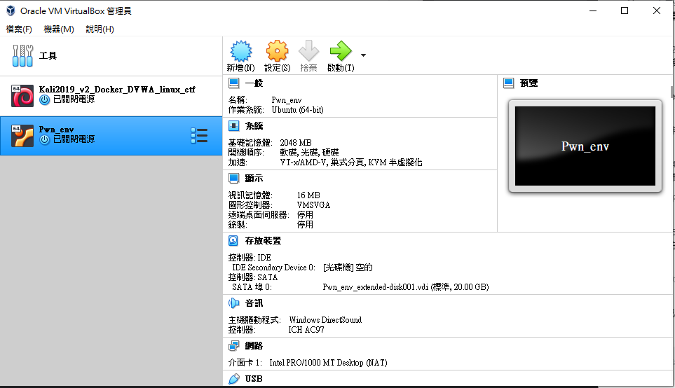
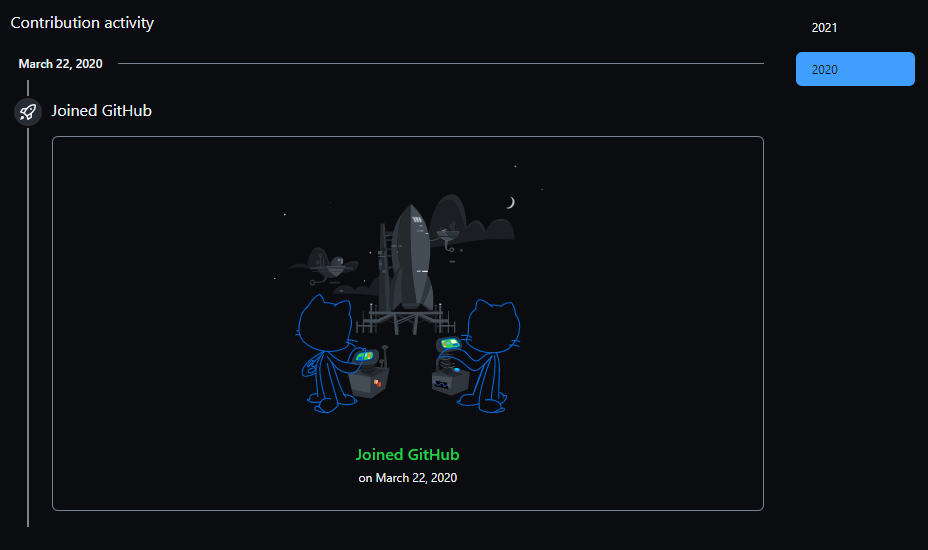
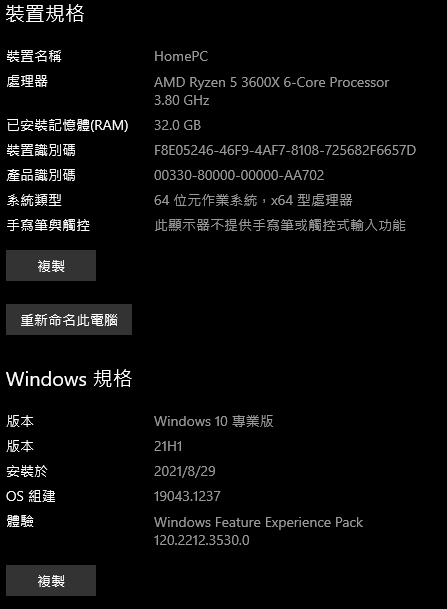
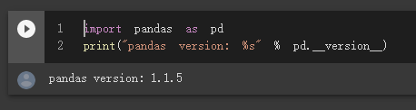

# 實作主題
```
1.DOWNLOAD(下載)並INSTALL(安裝) virtualbox

2.Sign up(申請)github account
  將GITHUB PO在網路大學

3.使用GOOGLE gmail登入

4.使用Google colab開發Python
```

# 1.DOWNLOAD virtualbox

- [virtualbox](https://www.virtualbox.org/wiki/Downloads)



# 2.下載並安裝linux 的ova
結果圖



# 3.申請github
  Already have a github account
  

# 4.電腦配置


# 5.Google Colab

